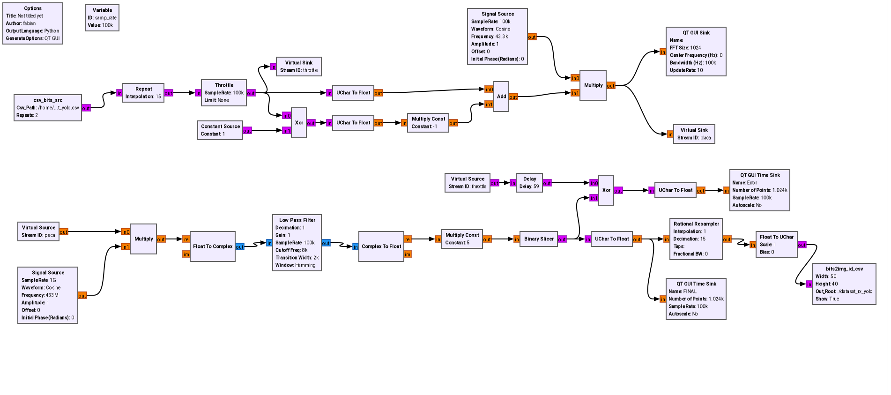
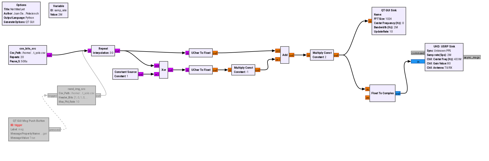
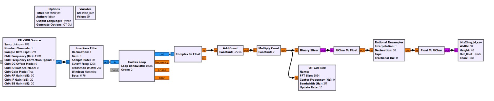

# 📡 Proyecto de Comunicaciones: Transmisión y Recepción de Imágenes con GNU Radio

Este proyecto implementa un sistema de transmisión y recepción de imágenes en blanco y negro a través de radiofrecuencia, usando GNU Radio. Se analizan los errores de bit por distancia y se visualiza el desempeño del sistema a distintas condiciones de canal.

---

## 🛠️ Estructura del sistema

### 🔁 Simulación

  
🔗 [Ver carpeta de simulación](./simulacion/)

### 📤 Transmisor

  
🔗 [Ver carpeta del transmisor](./transmisor/)

### 📥 Receptor

  
🔗 [Ver carpeta del receptor](./receptor/)

---

## 📊 Resultados por distancia

| Distancia | Porcentaje de fallos | PDF de análisis |
|----------:|----------------------:|-----------------|
| Cable     | 10.17%                    | [bit_analysis_cable.pdf](./results/cable/bit_analysis_cable.pdf) |
| 1 m       | 4.36%                | [bit_analysis_1m.pdf](./results/1m/bit_analysis_1m.pdf) |
| 2 m       | 11.03%               | [bit_analysis_2m.pdf](./results/2m/bit_analysis_2m.pdf) |
| 3 m       | 2.51%                | [bit_analysis_3m.pdf](./results/3m/bit_analysis_3m.pdf) |
| 5 m       | 2.85%                | [bit_analysis_5m.pdf](./results/5m/bit_analysis_5m.pdf) |
| 12 m      | 3.47%                | [bit_analysis_12.pdf](./results/12m/bit_analysis_12.pdf) |
| 21 m      | 5.80%                | [bit_analysis_21m.pdf](./results/21m/bit_analysis_21m.pdf) |

Los porcentajes de fallos se calculan como el número de imágenes que superan el umbral de 100 bits erróneos sobre el total de imágenes transmitidas.

---

## 📁 Dataset de pruebas

El conjunto de imágenes utilizadas para las pruebas se encuentra en la carpeta:

📁 [`./dataset/`](./dataset/)

Incluye:
- Imágenes originales: `dataset/autos/`
- Imágenes procesadas: `dataset/autos_proc/`
- Representación en bits: `dataset/autos_bits/`

---

## 📓 Cuadernos de análisis

- [`bit_analysis.ipynb`](./bit_analysis.ipynb): análisis de errores de bit por réplica y generación de gráficas.
- [`datos_autos.ipynb`](./datos_autos.ipynb): manejo y preprocesamiento de los datos, deteccion de placas usando YOLO y creación del csv para posterior analisis de resultados.

---

## 📌 Notas

- Las transmisiones se realizaron con parámetros constantes salvo por la distancia.
- Los errores se analizaron con tolerancia de 100 bits erróneos sobre 2000 bits transmitidos por imagen.
- Se descartaron imágenes con 2000 errores (imagen completamente invertida).

---

## 👥 Autores

- Miguel Fabian Duarte Diaz
- Juan David Palacios Chavez
- Daniel Hostos
- Yeison Rojas

---
